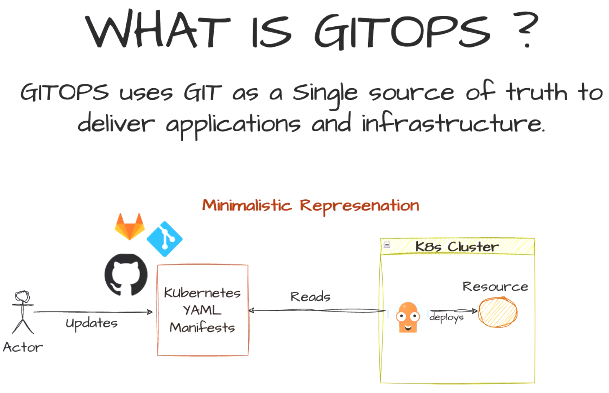
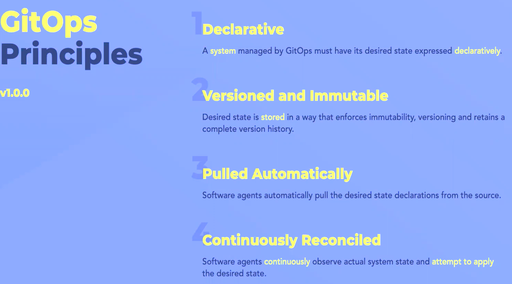
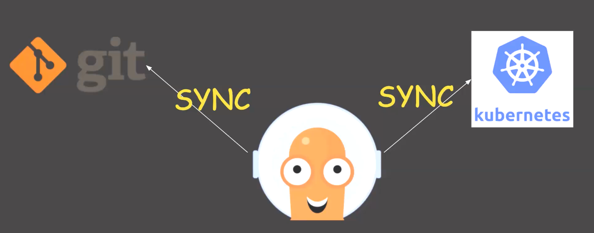
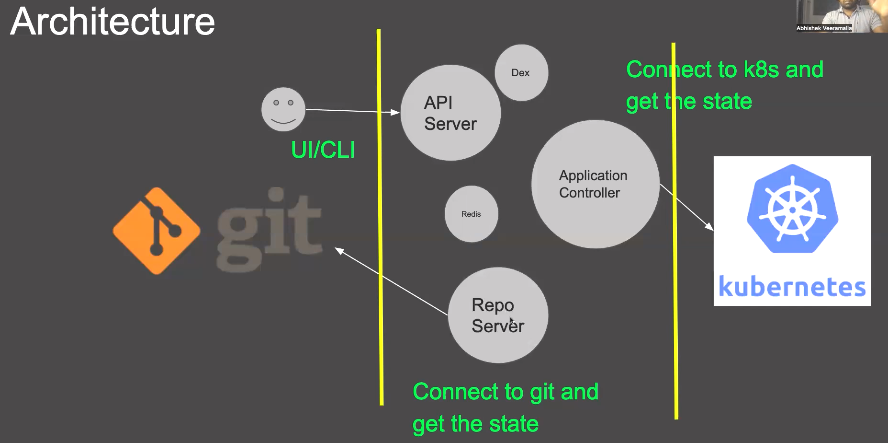
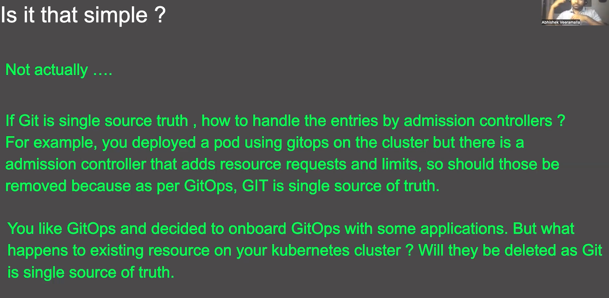

# [Git Ops Intro - Apr 18 2025 03:15:15pm](https://www.youtube.com/watch?v=eqiqQN1CCmM)

## What is gitops

Git becomes a single source of truth in Gitops to deliver apps and infra. GitOps uses git to track the changes for infra and apps.

## Tools for gitops

You can take an application and use a git ops controller (ArgoCD / FluxCD ) and deploy into your and deploy into your k8s controller

## Before gitops

#### Tracking application changes

##### CI - application changes

> You can track all the changes made to application through github, When we want to make change, we create a PR & PR goes through PR verification.

#### CD - infrastructure changes

You are making change by using shell scripts / python scripts and make changes using kubectl /helm or anything and deploy it to kubernetes.But there is no tracking without using git.
**Question: How legacy systems are tracking changes then?**
They take backup of existing file by copying them and rotating the files.

### What will happen Without gitops

You are trying to deploy your application on kubernetes.
We want to update a change to kubernetes worker node (by adding taint / want to increase resource of worker node).

## With gitops

When changes are made on clusters and infra we will track

### Scenario Tracking infra changes

a person updated the node configuration, and after few days you want to know what change you made exactly or someone asks you about the change you made.
how will you track your change and remember the exact details of the change?

> No mechanism to track the changes to kubernetes cluster.
> You cannot know what changes are made to kubernetes cluster before certain period of time.
> i.e there is no versioning, and no auditing, You don't actually who is making change.You can check the logins in machine, but you cannot map the changes with the user(Which change is made by which user is hard to trace).

With git ops we ensure that all the sourcecode is version controlled and tracked properly and goes through PR process. **In gitops git becomes source of truth for infra and application changes.**

#### example changes in k8s :

Node configuration changes - adding taints to nodes , you put yaml file of node in git repo, and PR process is followed.
When the PR is reviewed its merged into the Main branch and the change is picked by the tool which will deploys to k8s cluster.

> Other examples pod.yaml, Node.yaml(corresponds node configuration), deploy.yaml, manifest for admission controller.
> Git ops controller will reads the change and deploys it.

## Why use gitops for infra delivery?

When there are hundreds/large number of kubernetes clusters your resources becomes thousands, and infra management becomes critical than app itself.So git ops adds more value than maintaining infra manually.

You can simply take an application and deploy it on k8s cluster using gitops controller to say you know git ops but its much more than that.

Both CI and CD platform are important, You must pay attention to both of them.

## Principles of GitOps 9:00

- Declarative > Desired state must be expressed declaratively. you can't use binary or file , you must use code.
  - Yaml manifest in k8s we are using to modify anything such as (node, namespace, pod) are tracked in git declaratively.
  - What you see == what you have.
- Versioned and immutable
  > Version history is maintained, state is stored in a way it enforces immutability. Git might be the tool we are using but s3 buckets also have versioning , its not specific to git but its an idea of versioning .
  >

  - Immutable means that once a version is created, it is never altered — ensuring data integrity and historical accuracy. If the changes are made the version becomes different.
- Pulled automatically > When git repo changes , the deployment should happen automatically by either pull / push mechanism . controller will monitor repo continuously.
- Continuously reconciled >
  - If a resource is being monitored by gitops no user from outside without using git is allowed to make changes without using git. Git ops controller will override manual changes.
  - to make any change it must go through the git.
  - How reconciliation works ?
    - GitOps controller tracks all the resources in cache of k8s cluster (it has read access to all k8s ) along with access to entire git repository.
    - It compares state between git and k8s and makes changes when git changes.
    - 

## Is gitops only for k8s?

- no but its popular with k8s(they only work target k8s for now).

## Advantages of gitops

- Security - no unapproved changes without git will be overridden automatically.
- versioning - tracks changes we can use anything that has versioning , popular is git but we can use s3 as well there are tools for that.
- Auto upgrades - The new infra updates can be done with pull or push mechanism.
- Auto healing of any unwanted changes - state will always match versioned declared state.
- continuous reconciliation - similar to above. it will undo the unwanted changes.

## GitOps references Apr 26 2025 06:48:55pm

https://www.github.com/open-gitops Open gitops forum which creates standards.
popular tools - ArgoCD , Flux, Spinnaker

---

# [Architecture of GitOps Controllers. Apr 26 2025 06:50:07pm](https://www.youtube.com/watch?v=lR120HCErLI&t=10s)

## Popular gitops tools
- ArgoCD, fluxCD, JenkinsX, Spinnaker(emphasis's on deployment but not gitops but used for it).
## We will learn ArgoCD
- Created by Applatix (acquired by Intuit)
- OpenSource(over 13k+ github stars), popular contributors by Akuity, Black rock, CodeFresh, Intuit, RedHat.
- Graduated CNCF Project/

## What Gitops tools does 
Tries to maintain sync between version control & k8s

Controller will monitor changes in k8s and if they are not matching git, it will be reconciled according to the git.

## Architecture breakdown
Repo server - It will connect to git and gets state of it.
Application controller - connects with k8s and gets the state. This is a stateful set and redis is used for caching.
API server - is for UI & CLI interaction. Also handles user authentication.
**authentication**
Has a capability to connect with existing OIDC providers (or SSO providers) 
Dex - By default ArgoCD has Dex server(proxy server) which is very light weight and can connect with existing OIDC providers.

Redis - for caching. if application controller goes down, and it needs info what data is there once it comes back up(what is the information of clusters etc).

Application controller will compare the the git state with k8s state. 
If state is different, The application controller will change the state of k8s according to the git.

## ArgoCD Installation is done in 3 ways
- by yaml manifests.
- using helm
- kubernetes operator.

## Open questions, is it simple ?
you wanted to adopt gitops what will happen in following scenarios?
- how will you handle entries by admission controller?
- What happens to existing resource on k8s cluster.

**discussed in next video. Apr 26 2025 08:30:58pm**
---
# [ArgoCD Hands on Apr 26 202508:33:49pm](https://www.youtube.com/watch?v=ZgJQG475oME&list=PLdpzxOOAlwvKu7OZpgj1-MzJFqZ8RBp6f&index=3) 

## Apr 27 2025 07:54:54pm

## 

## 

## 

## 

## 

## 

---

# [Multi cluster deployment ArgoCD](https://www.youtube.com/watch?v=QhDnXsmSnfk&list=PLdpzxOOAlwvKu7OZpgj1-MzJFqZ8RBp6f&index=4)

## 

## 

## 

## 

## 

## 

## 

## 

## 

---

** need to find and watch video in which abhishek used jenkins for CI and ARGO CD for CD to understand clear picture **
